# Policy changes prevent disease eradication

Riz Fernando Noronha

---

$\quad$**Stringency** $\qquad\qquad$ **Excess mortality**

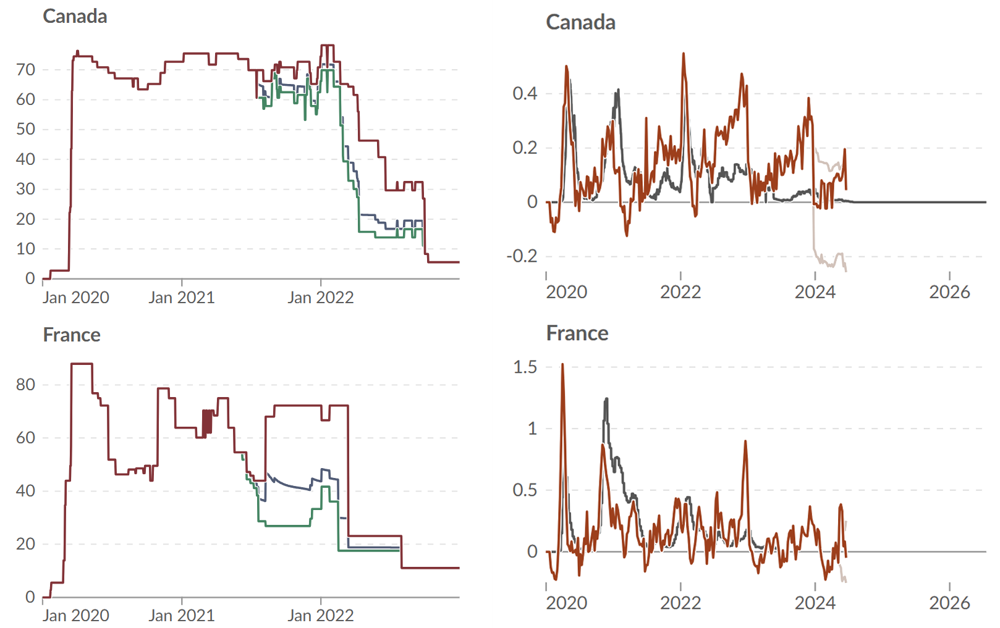

---

---

## Mechanism

$\\$

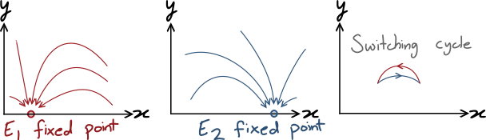

---

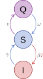

## The model

$$
\begin{align*}
\frac{\mathrm dS}{\mathrm dt} &= \omega Q - v S - \beta S I + \gamma I \\
\frac{\mathrm dQ}{\mathrm dt} &= v S - \omega Q \\
\frac{\mathrm dI}{\mathrm dt} &= \beta S I - \gamma I
\end{align*}
$$

Time can be rescaled in units of $\gamma=1$

---

### Test parameters:

Low $\beta$, no quarantine
$\beta$ = 0.9
$\gamma$ = 1.0
$v$ = 0.0
$\omega$ = 10.0

High $\beta$, enforced quarantine
$\beta$ = 1.5
$\gamma$ = 1.0
$v$ = 1.0
$\omega$ = 1.0

Switch at rate **$\alpha$**

---

#### $\alpha\to 0$: Fixed environment

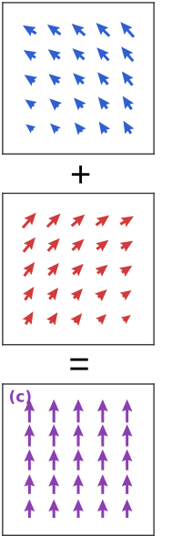

$$
\begin{alignat*}{2}
\frac{\mathrm dS}{\mathrm dt} &= \omega (1-I-S) - v S - \beta S I + \gamma I &&= 0 \\
\frac{\mathrm dI}{\mathrm dt} &= \beta S I - \gamma I &&= 0
\end{alignat*}
$$

Death in a fixed environment $\implies I^* < 0$:

$$\frac\gamma\beta \left( \frac{v}\omega + 1 \right) > 1$$

---

#### $\alpha\to\infty$: Time-averaged environment

$$
\begin{alignat*}{2}
\frac{\mathrm dS}{\mathrm dt} &= \frac12 \left( \frac{\mathrm dS}{\mathrm dt} \bigg\vert_{\text{Env 1}} + \frac{\mathrm dS}{\mathrm dt}\bigg\vert_{\text{Env 2}}\right) &&= 0 \\
\frac{\mathrm dI}{\mathrm dt} &= \frac12 \left( \frac{\mathrm dI}{\mathrm dt} \bigg\vert_{\text{Env 1}} + \frac{\mathrm dI}{\mathrm dt}\bigg\vert_{\text{Env 2}}\right) &&= 0
\end{alignat*}
$$

Disease survives $\implies I^* > 0$

$$\frac{\beta_1 + \beta_2}{\gamma_1+\gamma_2} \cdot \frac{\omega_1 + \omega_2}{\omega_1 + \omega_2 + v_1+v_2} > 1$$

---

### Sufficient and necessary conditions

Extinction in a fixed environment:

$$\frac{\gamma_1}{\beta_1} \left( \frac{v_1}{\omega_1} + 1 \right) > 1, \qquad \frac{\gamma_2}{\beta_2} \left( \frac{v_2}{\omega_2} + 1 \right) > 1$$

$\\$
Endemic under fast switching:

$$\frac{\bar\gamma}{\bar\beta} \left( \frac{\bar v}{\bar\omega} + 1 \right) < 1$$

---

<iframe width="100%" height="100%" src="https://rizfn.github.io/epidemiological-switching-environments/visualizations/SISQswitch">
</iframe>

---

<iframe width="100%" height="100%" src="https://rizfn.github.io/epidemiological-switching-environments/visualizations/SISQswitch/trajectories">
</iframe>

---

### Analysis

Make use of **Floquet theory!**

If there are no infected, then $S$ traces a periodic cycle. 

If we seed an infection, will it grow or die?

$$\lambda = \frac{1}{T} \oint \mathrm d \ln I = \frac1T \int_0^T \left( \frac{1}{I} \frac{\mathrm d I}{\mathrm d t} \right) \mathrm d t $$

$\lambda > 0$: Exponential growth
$\lambda < 0$: Exponential decay

---

### Critical rate

- $\mu=\omega+v$ (rate of leaving the susceptible pool)
- $s=\frac{\omega}{\omega+v}$ (disease-free susceptible fraction)
- $A=2-\beta_1s_1-\beta_2s_2$ (how badly it loses)
- $G=\left(\frac{\beta_1}{\mu_1}-\frac{\beta_2}{\mu_2}\right)(s_2-s_1)$ (gain from switching)

$\\$

$$ \alpha_c\,\frac{\bigl(1-e^{-\mu_1/\alpha_c}\bigr)\bigl(1-e^{-\mu_2/\alpha_c}\bigr)}{1-e^{-(\mu_1+\mu_2)/\alpha_c}}=\frac{A}{G}$$

---

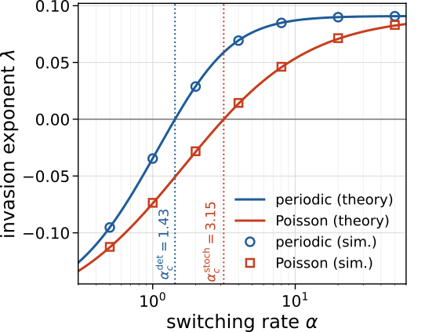

The same analysis holds for **random switching**!

$\alpha_c$ can be found in closed form:

$\\$

$$\alpha_c=\frac{A}{\,G-A\left(\dfrac{1}{\mu_1}+\dfrac{1}{\mu_2}\right)}$$

---

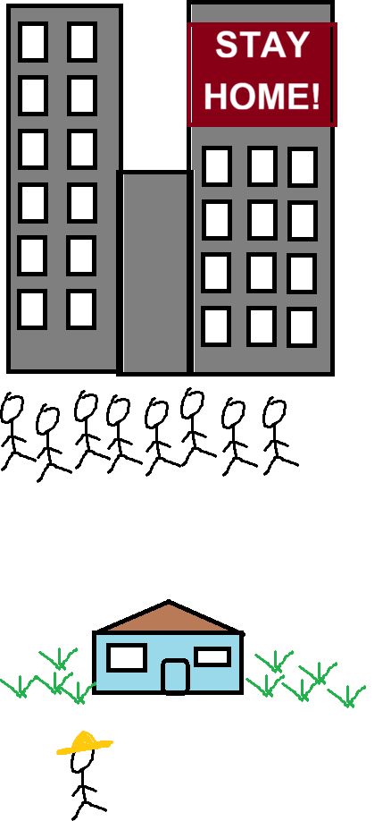

### Diffusion

Two communities, but can commute.

$$
\begin{align*}
\frac{\mathrm dS_i}{\mathrm dt} &= \omega_i Q_i - v_i S_i - \beta_i S_i I_i + \gamma_i I_i + D(S_j - S_i) \\
\frac{\mathrm dQ_i}{\mathrm dt} &= v_i S_i - \omega_i Q_i + D(Q_j - Q_i) \\
\frac{\mathrm dI_i}{\mathrm dt} &= \beta_i S_i I_i - \gamma_i I_i + D(I_j - I_i)
\end{align*}
$$

Same behavior!

---

### Quarantined can't move

$$
\begin{align*}
\frac{\mathrm dS_i}{\mathrm dt} &= \omega_i Q_i - v_i S_i - \beta_i S_i I_i + \gamma_i I_i + D(S_j - S_i) \\
\frac{\mathrm dQ_i}{\mathrm dt} &= v_i S_i - \omega_i Q_i  \\
\frac{\mathrm dI_i}{\mathrm dt} &= \beta_i S_i I_i - \gamma_i I_i + D(I_j - I_i)
\end{align*}
$$

---

<iframe width="100%" height="100%" src="https://rizfn.github.io/epidemiological-switching-environments/visualizations/SISQspace">
</iframe>

---

#### Why persist at low $D\,$?

At any $D>0$, $S_1 = S_2 = \bar S$:
$$\bar S=\frac{2}{\frac1{s_1}+\frac1{s_2}}$$

The condition for the effect is then:

$$s_2<\frac{1}{\beta_2}<\bar S<s_1<\frac{1}{\beta_1}$$

Dies in each ($s_i < 1/\beta_i$) but influxes help survive!

---

#### High diffusion

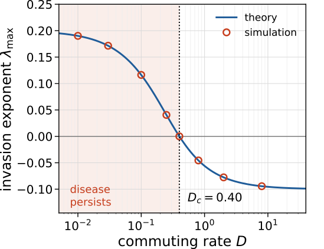

$I$ is also shared evenly, so it loses!

$$D_c=\frac{(\beta_1\bar S-1)(\beta_2\bar S-1)}{(\beta_1+\beta_2)\bar S-2}$$

Moving **susceptibles** helps the disease, moving **infectious** hurts it

---

### How long does the disease last?

**Deterministic:** endemic state lasts forever

**Finite $N$:** Fluctuations (noise) $O(1/\sqrt N)$

$$t_{\rm extinct}\sim e^{cN}$$

**Random switching:** Fluctuations from dwell time $\tau$

$$n(t) = NI_\mathrm{endemic} e^{-(1-\beta_1 \bar S) t}$$

Poisson: $P(\tau) \sim e^{-\alpha \tau}$

---

### Griffiths Phase

$t_\text{extinct} \sim N^{\theta}$

No switching: $\sim e^{cN}$

Exponent $\theta$ changes continuously

$$\theta=\alpha\left(\frac{1}{1-\beta_1\bar S}-\frac{1}{\beta_2\bar S-1}\right)$$

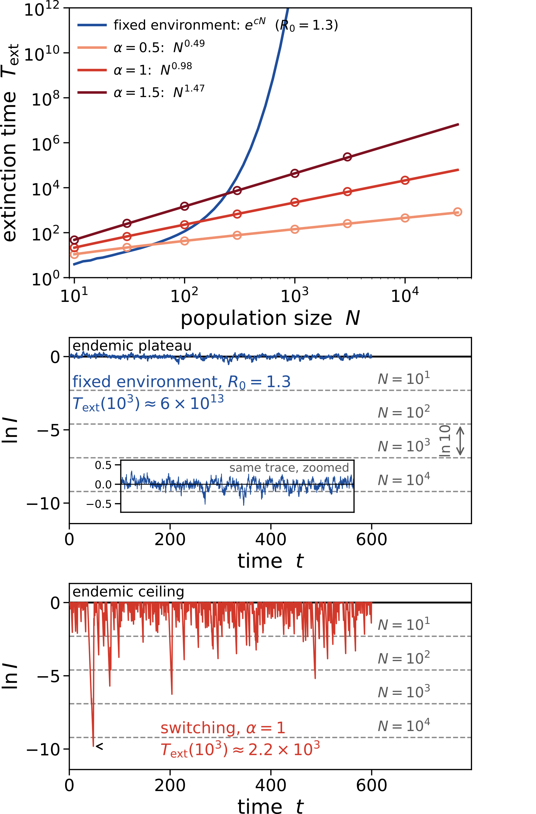

---

### Parrondo's Paradox

Two losing games, of tossing three biased coins:

$\\$

- Game A: Toss a coin, win with probability $p_1=\frac12-\epsilon$

- Game B: If $W$ is divisible by 3, win with $p_2=\frac1{10}-\epsilon$. 
$\\\qquad\quad\;\;\,$ If not divisible by 3, win with $p_3=\frac34-\epsilon$

---

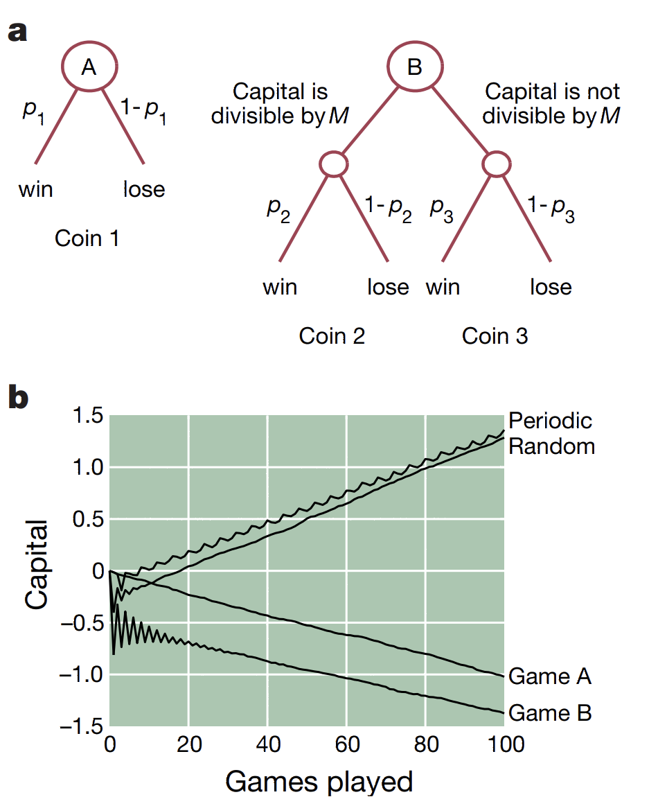

For $\epsilon=0.005$:

$p_2$ chosen $\approx 40\%$ of the time, so game B also loses.

Swapping A-A-B-B-... : **Wins!**
Swapping A-B-A-B-... : **Loses**
Swapping A-B-B-... : **Wins**

Random switching also **Wins!!**

---

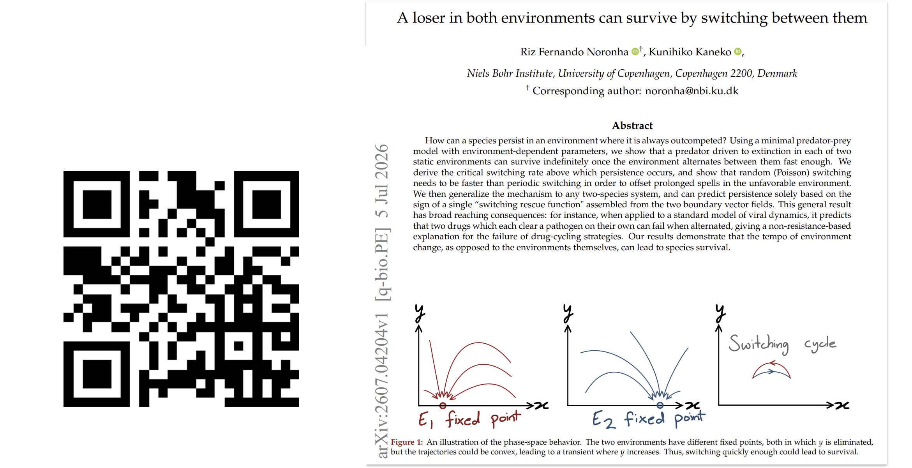

For more, $\qquad\qquad\qquad\qquad\qquad\qquad\qquad\qquad$
see previous work $\qquad\qquad\qquad\qquad\qquad\qquad\qquad\qquad$
(under review) $\qquad\qquad\qquad\qquad\qquad\qquad\qquad\qquad$

$\\$

$\\$

$\\$

$\\$

$\\$

$\\$

---

## Conclusion

Switching policy may keep the disease around!

Random switching also works.

Slow movement can also do the same.

Endemic state dies faster (exponential $\rightarrow$ power law)

---

# Additional slides 

---

#### The disease-free flow

With no infected, $Q = 1-S$, and the $S$ equation becomes **linear**:

$$\frac{\mathrm dS}{\mathrm dt} = \omega(1-S) - vS = -\mu\,(S - s)$$

$S$ relaxes towards $s$ at rate $\mu$, so a dwell of length $\tau$ ends at

$$S_\text{out} = s + (S_\text{in} - s)\,e^{-\mu\tau}$$

---

#### Only the endpoints matter

To know how much the disease grew we need $\int S\,\mathrm dt$. Rearrange the same equation:

$$S = s - \frac1\mu \frac{\mathrm dS}{\mathrm dt}
\qquad\Longrightarrow\qquad
\int_0^\tau \! S\,\mathrm dt = s\,\tau - \frac{S_\text{out}-S_\text{in}}{\mu}$$

The integral reduces to the **endpoints**.

True for *any* $\tau$, which is why random dwells are no harder than fixed ones.

---

#### Growth over one dwell

$$\frac{\mathrm d \ln I}{\mathrm d t} = \beta S - 1
\qquad\Longrightarrow\qquad
\Delta \ln I = (\beta s - 1)\,\tau \;-\; \frac{\beta}{\mu}\bigl(S_\text{out}-S_\text{in}\bigr)$$

$\\$

- **Static loss** $(\beta s-1)\tau$: negative in both environments.
- **Bonus** $-\frac\beta\mu(S_\text{out}-S_\text{in})$: positive whenever $S$ is *falling*.

Env 1 builds $S$ up (small $\beta/\mu$); env 2 spends it (large $\beta/\mu$).

---

#### One full cycle

Env 1 runs $S_b \to S_a$, env 2 runs $S_a \to S_b$.

Add the two dwells and divide by the cycle length $2/\alpha$:

$$\lambda(\alpha) = -\frac{A}{2} \;-\; \frac{\alpha}{2}\left(\frac{\beta_1}{\mu_1}-\frac{\beta_2}{\mu_2}\right)\bigl(S_a - S_b\bigr)$$

Everything here is a parameter except the **swing** $S_a-S_b$: how far $S$ actually travels.

---

#### The swing: periodic switching

Each dwell lasts exactly $1/\alpha$, so the turning points satisfy

$$S_a = s_1 + (S_b-s_1)e^{-\mu_1/\alpha},
\qquad
S_b = s_2 + (S_a-s_2)e^{-\mu_2/\alpha}$$

Two linear equations; solving and subtracting, a common factor survives:

$$S_a - S_b = (s_1-s_2)\,\Phi,
\qquad
\Phi = \frac{\bigl(1-e^{-\mu_1/\alpha}\bigr)\bigl(1-e^{-\mu_2/\alpha}\bigr)}{1-e^{-(\mu_1+\mu_2)/\alpha}}$$

$\Phi$ is the **fraction of the full gap** $s_1-s_2$ that $S$ covers. Slow: $\Phi\to1$. Fast: $\Phi\to0$.

---

#### The swing: random switching

$\tau$ is exponential with mean $1/\alpha$. As $S_\text{out}$ is linear in $S_\text{in}$, averaging gives the same two equations, with

$$\mathbb{E}\bigl[e^{-\mu\tau}\bigr] = \frac{\alpha}{\alpha+\mu}$$

replacing $e^{-\mu/\alpha}$. Every exponential then cancels:

$$\Phi = \frac{1}{1+\alpha\left(\frac{1}{\mu_1}+\frac{1}{\mu_2}\right)}$$

---

#### Commuting levels the susceptible pools

Set $I_i=0$. $Q$ cannot commute, so it balances **inside each community**:

$$0 = v_i S_i - \omega_i Q_i$$

Substituting into $\mathrm dS_i/\mathrm dt$, that pair cancels exactly:

$$0 = D\,(S_j - S_i)
\quad\Longrightarrow\quad
S_1 = S_2 \equiv \bar S$$

True at **any** $D>0$, however small.

---

#### What the common level is

Community $i$ then holds

$$S_i + Q_i = \bar S\left(1+\frac{v_i}{\omega_i}\right) = \frac{\bar S}{s_i}$$

people, and the two must add up to 2:

$$\frac{\bar S}{s_1} + \frac{\bar S}{s_2} = 2
\qquad\Longrightarrow\qquad
\bar S = \frac{2}{\frac{1}{s_1}+\frac{1}{s_2}}$$

A harmonic mean sits between its inputs, $s_2 < \bar S < s_1$: commuters **top up** the protected community.

---

#### Can a small outbreak grow?

With $S_i = \bar S$ everywhere, seeding a small $I_i$ gives

$$\frac{\mathrm dI_1}{\mathrm dt} = (\beta_1\bar S-1)I_1 + D(I_2-I_1),
\qquad
\frac{\mathrm dI_2}{\mathrm dt} = (\beta_2\bar S-1)I_2 + D(I_1-I_2)$$

Each community is now judged against the **mixed** pool, not its own $s_i$:

- open: $\bar S < s_1$, so $\beta_1\bar S-1$ is even more negative
- protected: $\bar S > s_2$, so $\beta_2\bar S-1$ can be **positive**

---

#### The growth rate falls with $D$

$$\lambda_{\max}(D) = \frac{(\beta_1+\beta_2)\bar S - 2}{2} - D + \sqrt{\left(\frac{(\beta_1-\beta_2)\bar S}{2}\right)^{2} + D^{2}}$$

$\beta_2\bar S-1>0$ at $D\to0$; the plain average $<0$ at $D\to\infty$; monotone in between.

So it crosses **once**:

$$\frac{1}{D_c} = \frac{1}{\beta_1\bar S-1} + \frac{1}{\beta_2\bar S-1}$$

---

#### Fast commuting always loses

$$\lambda(D\to\infty) > 0
\quad\Longleftrightarrow\quad
\frac{\beta_1+\beta_2}{\frac{1}{s_1}+\frac{1}{s_2}} > 1$$

A fraction $\frac{p_1+p_2}{q_1+q_2}$ always lies **between** $\frac{p_1}{q_1}$ and $\frac{p_2}{q_2}$ — here, between $\beta_1s_1$ and $\beta_2s_2$.

Both of those are below 1, so this can never hold. No parameters escape.

Switching in *time* escapes because $\beta$ and $s$ get averaged **separately**.

---

#### Where the power law comes from

During a bad dwell, $\;n(t) = N I_\text{end}\,e^{-(1-\beta_1\bar S)\,t}$.

Reaching $n=1$ needs $\tau = \dfrac{\ln\bigl(NI_\text{end}\bigr)}{1-\beta_1\bar S}$, which grows only like $\ln N$:

$$P(\tau) \sim e^{-\alpha\tau} = N^{-\alpha/(1-\beta_1\bar S)}$$

**One** unlucky dwell, not $N$ unlucky people.

---

#### The exponent, exactly

Extinction needn't happen in a single dwell. Let $x = \ln I_\text{end} - \ln I$ be the depth, and $P_i(x)$ the density of sitting at $x$ while in environment $i$:

$$\frac{\mathrm d}{\mathrm d x}\Bigl[(1-\beta_1\bar S)P_1\Bigr] = -\alpha P_1 + \alpha P_2$$
$$\frac{\mathrm d}{\mathrm d x}\Bigl[-(\beta_2\bar S-1)P_2\Bigr] = \alpha P_1 - \alpha P_2$$

Flow along $x$ on the left, switching on the right. $P_i \propto e^{-\theta x}$ solves both.

---

#### Reading $\theta$

$$\theta = \underbrace{\frac{\alpha}{1-\beta_1\bar S}}_{\text{one long bad dwell}} - \underbrace{\frac{\alpha}{\beta_2\bar S-1}}_{\text{climbing back in between}}$$

- $\theta>0$ exactly when $\beta_2\bar S-1 > 1-\beta_1\bar S$, i.e. when the disease persists
- $\theta \propto \alpha$: faster switching averages the two speeds out, leaving less noise
- $t_\text{extinct}\sim N^\theta$ passes continuously through $1, 2, 3,\dots$

---

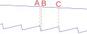

#### Two ratchets!

- Start at B, top ratchet

- Switch when a ball reaches A, OR

- Switch before reaching C.

- After steady state, switch back!

---

Uses two states to win.

Game B loses for its own money distribution, but can win by using a distribution from game A.

Similarly, we use ICs generated by environment 1 to have environment 2 boost the population.